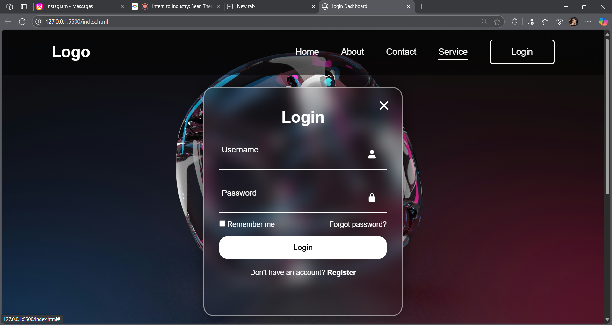

# 🔐 Custom Login UI – HTML, CSS & JavaScript

This project is a sleek, modern **Login Interface** built using **HTML**, **CSS**, and **JavaScript**. It features a clean, responsive layout with stylish design elements like **glassmorphism**, icon integration, and subtle animations.

---

## 🚀 Features

- ✅ Popup login modal  
- ✅ Username and password inputs with icons  
- ✅ "Remember me" checkbox  
- ✅ "Forgot password?" and "Register" links  
- ✅ Responsive design across screen sizes  
- ✅ Glassmorphism effect with a dark gradient background  
- ✅ Interactive close button and input focus effects

---

## 🛠 Tech Stack

- **HTML** – semantic structure  
- **CSS** – modern styling (glassmorphism, flexbox, animations)  
- **JavaScript** – modal toggle and interactivity  
- **VS Code** + **Live Server** – for development and testing

---

## 📸 Screenshot

> *Replace the image above with your actual screenshot.*

---

## 💡 What I Learned

- Structuring accessible and semantic HTML
- Using advanced CSS techniques (transparency, blur, gradients)
- Creating UI components with reusable design patterns
- Adding JavaScript to control DOM behavior

---

## 📁 How to Run

1. Clone this repository:
2. Open the folder in VS Code (or your editor).
3. Right-click on `index.html` and choose **"Open with Live Server"**  
*(or simply open the file in a browser)*

---

## 📬 Feedback

This is my **first custom UI project**, and I'm eager to improve. Feel free to open issues or share suggestions!

---

## 🔗 Connect with Me

[LinkedIn](www.linkedin.com/in/nithish-kannan-m)  
[GitHub](https://github.com/NithishKannanM)

---

## 🏷️ Tags

`HTML` `CSS` `JavaScript` `UI/UX` `Glassmorphism` `Frontend` `Login Page` `Web Design`
